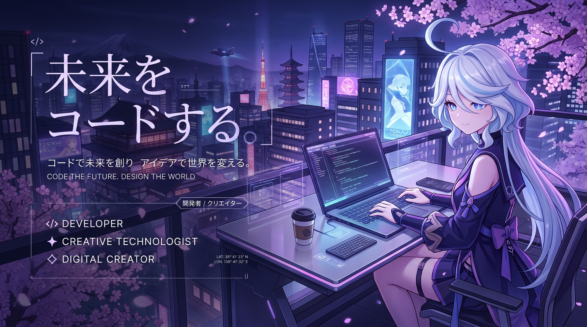

# 🌸 YuuBey | Furina Simp

### AI ENGINEER • WEB DEVELOPER 

**「コードで未来を創る」**

*Creating the future through code.*

---

## 👋 About Me

Hi! I'm **Beyy**.

I'm an Informatics student who enjoys building
web applications, experimenting with AI,
and creating digital projects.

I'm currently exploring:

- 🤖 Artificial Intelligence
- 💻 Web Development
- 📱 Mobile Development
- 🎨 UI/UX
- 🎮 Gaming & Content Creation

---

## 🎴 CHARACTER PROFILE

### 「YuuBey」

| Attribute | Status |
|---|---|
| 🎓 Class | Informatics |
| 🤖 Main Path | AI Engineering |
| 💻 Specialty | Web Development |
| 📱 Secondary | Mobile Development |
| 🌸 Theme | Japanese / Cyber |

---

## 🏆 ACHIEVEMENTS

| Achievement | Description |
|---|---|
| 🌸 Code Explorer | Exploring the world of programming |
| 🤖 AI Apprentice | Exploring Artificial Intelligence |
| 🌐 Web Creator | Building web applications |
| 🎮 Game Explorer | Gaming & digital content |

---

## ⚔️ TECH SKILLS

### 💻 Development

### 🗄️ Database

### 🤖 Artificial Intelligence

---

# 🚀 FEATURED PROJECTS

### 🌸 Nihon Quest

Japanese learning platform for studying:

**Hiragana • Katakana • Kanji • Vocabulary • Grammar**

---

### 🤖 AI Projects

Experiments and applications involving:

**Artificial Intelligence • Machine Learning • LLM**

---

### 🎬 YDownloader

A media downloader project designed for multiple platforms.

---

## 🌸 GITHUB JOURNEY

---

## 🌸 また会いましょう
  
**「コードで未来を創る」**
  
*Creating the future through code.*

🌸 🌸 🌸 🌸 🌸

